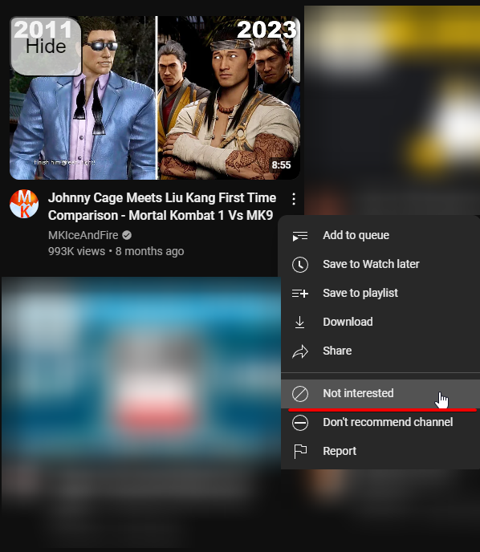

# Userscripts for Youtube

Currently there is only one userscript for YouTube.
Maybe in the future there will be more.

## ytd_hidevideo

This script adds an easy to click button to tell YouTube to hide video from
recommended list.

This looks like this:

It basically emulates click to this menu item:

